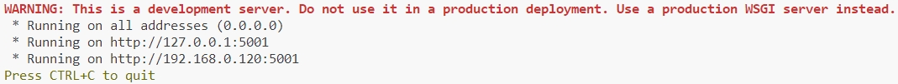

# ICRA24_OpenAnnotate3D 

## Overview
Our program consists of `server` part and `client` part:
1. The client is written in `Python 3.8.10` and `C#` code.
2. The server is written in `Python 3.8` code.
3. Since our client implementation is complex and requires a lot of configuration, for your convenience, we provide compiled executable files, which are located in the `Client` directory.
4. Since the `VTK` version used by the client is a trial version, the trial period is one month, so the client exe files will only available for 30 days. We will update it regularly. So, if your client is not working please download it again.
5. The online version of the client is a limited version only supports reading a maximum of 10 pictures and 10 point cloud files, and will ignore extra files. If you need a full version, please contact the author.

## Server

### System configuration

- Operating system: `Ubuntu 18.04` and above
- GPU recommended `RTX 4060` and above

### Environmental preparation

1. Go to the [OpenAI](https://openai.com/) website to get a `GPT Key`. We recommend using GPT 4.0.
2. Add the following environment variables to the file `~/.bashrc`:

```bash
# Please sk-xxx with your API KEY
export OPENAI_API_KEY="sk-xxx"
``` 

3. Open a terminal window and enter the following command to create the server running environment.

```bash
# Download code
mkdir openannotate3d
cd openannotate3d
git clone https://github.com/Fudan-ProjectTitan/OpenAnnotate3D.git
cd OpenAnnotate3D/ICRA24_OpenAnnotate3D/Server

conda create -n openannotate3d-icra24 python=3.8
conda activate openannotate3d-icra24
conda install pytorch==2.2.2 torchvision==0.17.2 torchaudio==2.2.2 pytorch-cuda=11.8 -c pytorch -c nvidia

pip install -r requirements.txt
```

4. Download [GroundingDINO Model Checkpoints](https://github.com/IDEA-Research/GroundingDINO/releases/download/v0.1.0-alpha2/groundingdino_swinb_cogcoor.pth) and [Segment Anything Model Checkpoints](https://dl.fbaipublicfiles.com/segment_anything/sam_vit_h_4b8939.pth), And put the downloaded file into the `models` folder
5. Run the code `python server.py` in the terminal
6. After completing the above steps, you will see the following output in the terminal.



The port used by the server is `5001` by default. If you need to use other ports, please modify.

```python
process = multiprocessing.Process(target=(app.run(host='0.0.0.0', port=5001)))
```

After the modification, run `server.py` to take effect.

## Client

### System configuration

- Operating system: `Windows 10` and above
- RAM: `16G` and above
- GPU recommended `RTX 4060` and above

### pre-requirements

1. Install `Python 3.8.10`. Installing other versions of Python may cause the client to fail to run properly.
2. Install runtime.
```bash
pip install numpy
pip install matplotlib
```

3. Decompress the client compressed file to an English path.
4. Find the file `OpenAnnotate3D.dll.config` under the client root directory, modify the following configuration.
- Change `Server request address` value to your server address.
- Change the `Python environment address` to the directory selected during installation in step 1.
```xml
<?xml version="1.0" encoding="utf-8"?>
<configuration>
	<appSettings>
		<add key="Host" value="http://127.0.0.1:5001"/>

		<add key="PythonDLL" value="E:\Program Files\Python38\python38.dll"/>
	</appSettings>
</configuration>
```

5. Put the image and point cloud files in the `Data` directory of the client files. The directory structure is as follows
- Data
   - 000000.bin
   - 000000.png
   - 000001.bin
   - 000001.png
   - ...
6. The point cloud file suffix is: `.bin`, the image file suffix is: `.png`

7. Run `OpenAnnotate3D.exe`

## Citation

```bibtex
@article{zhou2023openannotate3d,
  title={OpenAnnotate3D: Open-Vocabulary Auto-Labeling System for Multi-modal 3D Data},
  author={Zhou, Yijie and Cai, Likun and Cheng, Xianhui and Gan, Zhongxue and Xue, Xiangyang and Ding, Wenchao},
  journal={arXiv preprint arXiv:2310.13398},
  year={2023}
}
```